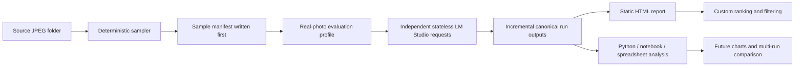
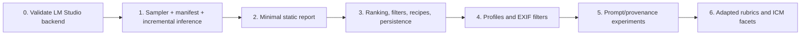
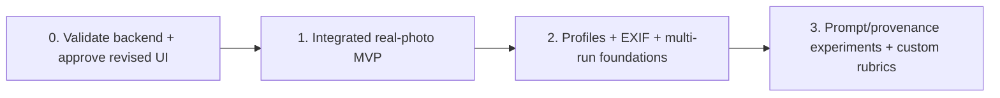
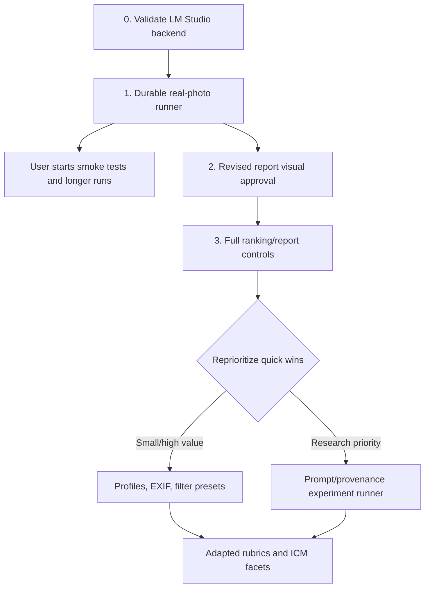

# Implementation Roadmap Options and Requirements Index

**Status:** Planning only, no functional implementation in this document  
**Branch:** `chatgpt/photo-sampling-report-mvp`  
**Base:** `chatgpt/lm-studio-backend`  
**Last updated:** 2026-08-07

## 1. Purpose

Provide a single index for the requirements already documented and compare alternative implementation sequences before functional work starts.

The ordering is intentionally adjustable. After each small implementation slice, the remaining backlog should be reprioritized using current evidence:

1. Required for correctness, data preservation, or reproducibility
2. Small, high-value quality-of-life improvement
3. Necessary to make the prototype useful for real photographs
4. Larger feature that can consume existing stored outputs without rerunning inference
5. Deferred research or integration work

A quick feature may move earlier when it does not delay the earliest usable real-photo run. A large feature should remain deferred even when desirable if the same underlying data can be preserved now and surfaced later.

## 2. Requirements document index

### `docs/real-photo-evaluation-plan.md`

Primary functional specification:

- Real-photo-first scope
- Existing upstream AI-image path preserved but not expanded
- Stateless LM Studio only
- JPEG folder discovery
- Recursive traversal by default
- Sample up to `N`, without replacement, seed `42`
- Durable sample manifest before inference
- Real-photo dimensions and stock Qwen baseline
- Aspect-ratio-preserving preprocessing
- Immutable official scores
- Unrestricted custom weights
- Independent ranking and filtering
- Static local HTML report
- Original JPEG references, pagination, themes, local state
- Ranking-recipe JSON import/export
- Deferred EXIF filters, profile management, prompt experiments, ICM facets, PhotoKin, and stateful inference
- Public-repository safety and useful-test policy

### `docs/prompt-provenance-experiment-spec.md`

Deferred experimental design:

- Actual versus presented provenance
- Reference-text source, actual role, and presented role
- Frozen inferred candidate prompts
- Exact-prompt, possible-prompt, similar-image, description, and no-reference conditions
- One homogeneous condition per run
- No mixing prompt/rubric variants across L1 dimensions in a normal run
- Independent stateless L1 requests
- Stable run identity and condition digest
- Same-manifest comparisons across separate runs

### `docs/analysis-ready-output-spec.md`

Canonical output and future visualization contract:

- `run.json`
- `sample-manifest.json`
- `results.jsonl`
- Long-form `facet-scores.csv`
- Long-form `aggregate-scores.csv`
- Static `report.html`
- Stable run, image, facet, rubric, profile, and reference-text identities
- Same-image and different-image comparisons across runs
- Distinct `N/A`, `not_evaluated`, missing, parse-failed, and request-failed states
- Official scores separate from custom recipe-derived scores

## 3. Coverage assessment

All requirements discussed so far are represented in the three specifications above, including deferred features. The following implementation details remain intentionally unresolved because they should be selected during the relevant implementation slice rather than prematurely fixed in the product specification:

- Exact internal module/file boundaries
- Exact CLI flag names beyond already accepted examples
- Exact output-directory naming
- Exact long-edge image bound, provided aspect ratio is preserved
- Exact report component implementation
- Whether later HTTP concurrency improves LM Studio throughput
- Exact text of future adapted/ICM rubrics
- Exact visualization types for future multi-run comparison

These are implementation decisions, not missing product requirements.

## 4. Newly identified operational requirement: incremental durability

The user may run very small smoke tests or long overnight evaluations. A long run must not keep all useful progress only in memory until completion.

The first usable real-photo runner should therefore:

1. Write the sample manifest before inference.
2. Persist each completed image result incrementally.
3. Flush or atomically replace summary metadata at safe checkpoints.
4. Record request, parse, and image failures without discarding successful images.
5. Support a minimal resume path or, at minimum, skip already completed image/dimension tasks when rerun against the same run directory and condition identity.
6. Mark the run as `running`, `completed`, `interrupted`, or `failed`.

This is classified as correctness/data-preservation work, not optional polish.

## 5. Shared architecture for every roadmap

The canonical outputs are the boundary that allows report work, ranking work, and future experiments to proceed without rerunning Q-Judger.

## 6. Roadmap A: fastest usable result

This option deliberately spreads functionality across more phases so the first real-photo run is available as early as possible.

### A0. Backend validation

- Clone and run PR #1 branch
- Unit tests
- One-image live LM Studio smoke test
- Confirm parsing and output shape

### A1. First durable real-photo run

- Folder input
- JPEG discovery
- Recursive default and `--no-recursive`
- Up-to-`N` sampling without replacement
- Seed `42`
- Manifest before inference
- Real-photo stock-rubric profile
- Quality, Aesthetics, Creative Generation
- Aspect-ratio-preserving input
- Stateless LM Studio
- Incremental/resumable canonical outputs
- No polished report controls yet

**User can begin real runs after A1**, using JSONL/CSV outputs even before the report is complete.

### A2. Minimal static report

- Direct original-file references
- Natural-aspect gallery
- Basic pagination
- Official aggregate/L1/L2/L3 display
- Raw output inspector
- Default HTML generation and separate report regeneration

**User can visually inspect results after A2.**

### A3. Useful ranking report

- Custom signed weights
- Score filters independent from ranking
- Built-in and custom recipes
- `localStorage`
- Recipe JSON export/import
- Search, sorting, themes, fuller inspector

### A4 and later

- Profiles, EXIF/capture filters, then prompt/provenance experiments and custom rubrics

### Advantages

- Earliest access to real model results
- Smallest debugging surface per slice
- User can collect data while report work continues
- Failures are isolated more easily

### Disadvantages

- First report is intentionally basic
- More phase handoffs
- Some desired controls arrive after initial runs

## 7. Roadmap B: ambitious compressed MVP

This option completes most prototype functionality before the user starts relying on it.

### B0. Validation and design checkpoint

- Live backend smoke test
- Revise the static report mock to include profile identity, official/custom scores, ranking recipes, filters, and persistence controls
- Visual approval before coding the report

### B1. Integrated MVP

Implement together:

- Sampling and durable manifest
- Incremental/resumable inference
- Analysis-ready outputs
- Minimal real-photo profile support
- Full static report
- Official hierarchy
- Custom ranking and filters
- Recipe persistence/import/export
- Search, sorting, pagination, themes
- Report regeneration

### B2. Near-term expansion

- Custom profile JSON
- Facet applicability metadata
- EXIF extraction and capture filters
- Filter presets
- Basic profile creation/duplication
- Stronger run-library conventions

### Advantages

- First release feels substantially complete
- Less temporary UI
- Fewer user-visible transitions between report versions

### Disadvantages

- Longer wait before the first real run
- Larger combined debugging surface
- A report bug can delay inference testing even though the data pipeline is ready
- Higher risk of scope creep before model usefulness is established

## 8. Roadmap C: hybrid recommendation

This option creates a durable operational baseline quickly, then immediately improves the report while the user can already run samples.

### C0. Validate PR #1

Do this first because every later phase depends on live LM Studio compatibility.

### C1. Durable real-photo runner

Implement only the operational foundation:

- Folder sampling up to `N`
- JPEG-only, recursive by default
- Seed `42`, no duplicates
- Manifest first
- Real-photo stock-rubric profile
- Aspect-preserving preprocessing
- Stateless inference
- Incremental/resumable canonical outputs
- Very small generated index/report sufficient to open source images and inspect raw/official scores

This is the earliest meaningful user checkpoint.

### C2. Revised visual specification

Before building the full report UI, revise the existing mock to restore:

- Evaluation-profile/run identity
- Official versus custom score distinction
- Ranking recipes
- Independent score filters
- Unrestricted weights
- Local persistence and recipe import/export

Obtain visual approval, then treat it as the UI specification.

### C3. Full static report over existing run data

Build the approved report without changing inference or requiring reruns:

- Ranking/filter editor
- Recipes
- Search/sort/pagination
- Theme and inspector
- Raw hierarchy and response panels
- Report regeneration command

### C4. Dynamic reprioritization checkpoint

After real runs exist, inspect actual friction and effort estimates. Pull forward quick wins that improve the current workflow without blocking larger research work.

Candidates:

- Custom profile JSON loading
- L1 enable/disable flags
- Facet applicability labels
- EXIF extraction and shutter filter
- Filter-preset JSON
- Small report usability fixes

Large work remains deferred unless evidence makes it the next priority:

- Full profile manager with folders/pins
- Full multi-run comparison UI
- Prompt inference pipeline
- Adapted rubrics
- Custom ICM facets
- PhotoKin integration

### Why this is recommended

- The user gets a real-photo runner early.
- Overnight results remain safe and reusable.
- The report can evolve against stored outputs without spending model time again.
- The UI is not built blindly; its richer state receives a visual approval pass.
- Quick wins can move forward based on actual use rather than the original phase number.

## 9. Priority classes

### Required before first real-photo run

- Live LM Studio backend validation
- Folder/JPEG discovery
- Up-to-`N` deterministic sampling without replacement
- Manifest written first
- Real-photo dimensions/profile identity
- Aspect-ratio preservation
- Stateless request isolation
- Incremental durable outputs and explicit error states
- Analysis-ready identifiers/schema
- Public-repository safety

### Required before the first useful ranking decision

- Static report with original images
- Official score hierarchy
- Custom signed weights
- Ranking and filtering independence
- Recipe persistence and JSON import/export
- Pagination and basic search/sort

### Quick wins that may move earlier

- `--no-recursive`
- HTML default with `--no-html-report`
- Report regeneration command
- System/light/dark theme
- Page-size persistence
- Custom profile JSON loading
- L1 enable/disable flags
- Facet applicability labels
- Basic EXIF extraction for shutter speed

A quick win moves earlier only after its actual implementation cost is inspected.

### Deferred until model usefulness is established

- Stateful LM Studio
- Prompt caching work
- AI-image-specific development
- Prompt/provenance matrix runner
- Inferred-prompt generation
- Multi-run comparison UI and built-in charts
- Adapted and ICM-aware rubrics
- New photographic facets
- Full profile library, folders, and pins
- SQLite/PhotoKin integration
- Thumbnail cache unless direct originals prove too slow

## 10. Decision gates

### Gate 1: backend compatibility

Proceed only after one live image returns parseable stock Qwen output through LM Studio.

### Gate 2: data-contract stability

Before a long run, confirm that canonical output contains enough information to regenerate reports and compare future runs.

### Gate 3: first real-photo evidence

Run a small sample and inspect whether the stock facets produce usable variation rather than mostly `N/A`, uniform scores, or obvious prompt-framing failures.

### Gate 4: report priority

Use the first real output to decide whether the next highest-value work is ranking UI, profile changes, or prompt/provenance experiments.

### Gate 5: advanced research

Do not build the full prompt matrix or custom ICM rubric until the baseline output has been inspected and the experimental question is narrowed.

## 11. Recommended choice

Use **Roadmap C: hybrid**.

The first implementation target should be a durable, resumable, analysis-ready real-photo runner with a deliberately small report. Once the user can start running images, continue immediately with the approved full static ranking report. Reassess the remaining backlog after each slice and pull forward genuinely small, high-value features.

This preserves the prototype objective while preventing the expanding experiment ideas from delaying the first useful result.
